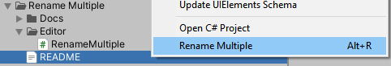
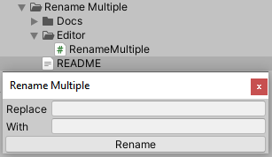

# Rename Multiple

> Utility for renaming multiple assets and/or gameobjects.

The renaming uses **pattern substitution**. By default, renaming function is mapped to shortcut "Alt + R". This utility **will not rename scripts or folders**.

## Usage

Select the assets or gameobjects you wish to rename, then press "Alt + R" (or right click and select it from the menu).

Type the pattern that you wish to substitute and the resulting string. Then just press "Rename" and you're done! 

Note that this utility is **case sensitive**.

